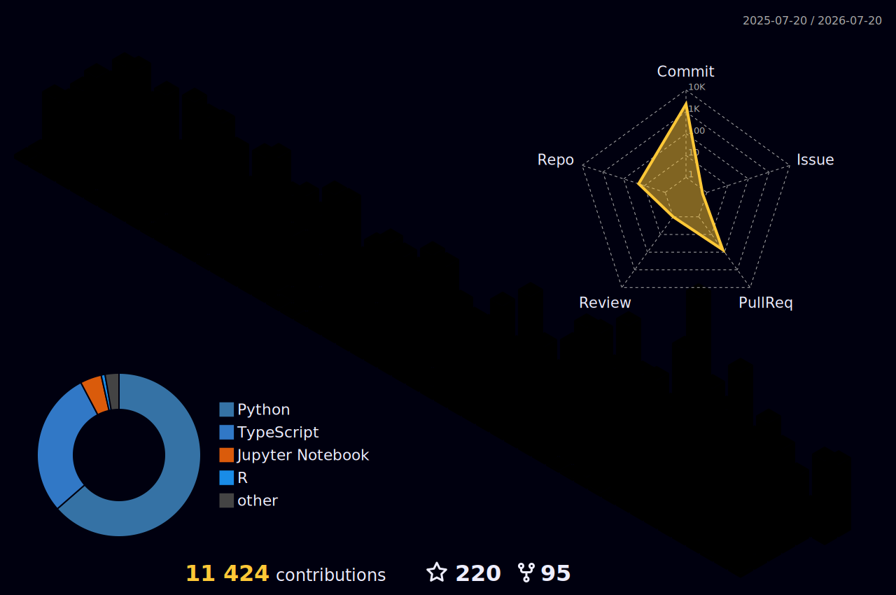

<!-- HEADER BANNER -->

<!-- GREETING -->

<!-- PROFILE VIEWS + COMMITTERS BADGE -->

  
  &nbsp;
  

<!-- TYPING SVG -->

 
<!-- SOCIAL BADGES -->

  
  
  
  
  
  
  

## 👨‍💻 About Me

I am a **Senior Machine Learning Engineer** at **Conversion Logix (CLX)** with **13+ years** of experience architecting and deploying robust AI and data solutions. My work sits at the intersection of academic rigor and industrial application — combining a deep background in **Applied Physics (MSc)** and **Modeling (PhD)** with hands-on expertise in MLOps, LLMOps, cloud architecture, and backend development.

| | |
|---|---|
| 🏢 **Role** | Senior ML Engineer @ Conversion Logix — production ML systems & real-time inference |
| 🎓 **Academic** | PhD in Modeling — Time Series Forecasting & Statistical Modeling |
| 🔭 **Focus** | RAG systems, transformer architectures, hybrid forecasting models |
| 🌱 **Learning** | **Rust** for performance-critical systems · **Julia** for scientific computing |
| 🤝 **Open to** | Open-source AI collaboration · Academic research · Speaking opportunities |
| 📍 **Location** | Chile 🇨🇱 and Colombia 🇨🇴 |

---

## 🏆 GitHub Trophies 

---

## 📊 GitHub Statistics

&nbsp;&nbsp;

 

---

## 📈 Contribution Activity

---

## 🚀 Featured Projects

<table border="0" cellpadding="6" cellspacing="0">
  <tr align="center">
    <td>
      
    </td>
    <td>
      
    </td>
  </tr>
  <tr align="center">
    <td>
      
    </td>
    <td>
      
    </td>
  </tr>
  <tr align="center">
    <td>
      
    </td>
    <td>
      
    </td>
  </tr>
</table>

---

## 🛠️ Tech Stack & Tools

### 🖥️ Languages & Runtimes

  
  
  
  
  
  
  
  
  
  
  

### 🤖 AI, ML & Data Science

  
  
  
  
  
  
  
  
  
  
  
  

### ⚙️ Backend & Frameworks

  
  
  
  

### 🗄️ Databases

  
  
  
  
  
  
  
  
  
  

### 🔧 Data Engineering, DevOps & MLOps

  
  
  
  
  
  

### ☁️ Cloud Platforms

  
  
  

### 🧰 Developer Tools

  
  
  
  
  
  
  
  

---

## 🌐 3D Contribution Calendar

> ⚙️ *Enable by adding the [github-profile-3d-contrib](https://github.com/yoshi389111/github-profile-3d-contrib) GitHub Action to your profile repo. Until then, the streak & activity graph above show your contributions!*

---

## 💬 Random Dev Quote

---

<!-- FOOTER WAVE -->

*"The goal is to turn data into information, and information into insight."* — Carly Fiorina

 

**Thanks for visiting! If you find my work useful, consider leaving a ⭐ on any repo.**

